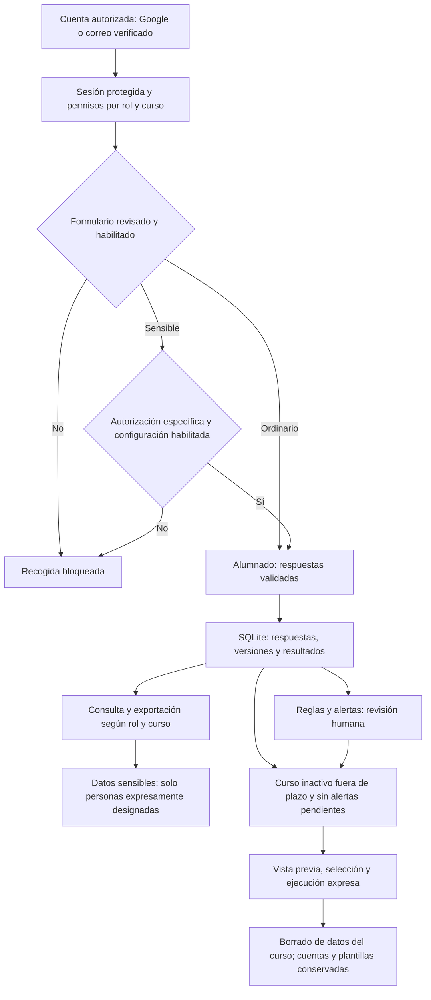

# Cuestionarios Cuatrovientos

Aplicación Flask + Angular 21 para gestionar los distintos cuestionarios del centro. Incluye roles de alumnado, tutoría y administración; invitaciones por código; formularios versionados y editables; múltiples intentos; alertas protegidas; análisis individual/grupal y exportación Excel/PDF.

Consulta primero la [guía de privacidad y actualización](docs/PRIVACIDAD_Y_ACTUALIZACION.md), con diagrama, migración y requisitos pendientes. Los formularios sensibles o sin revisar están bloqueados por defecto.

## Adecuación al RGPD

Documentación revisada el 9 de octubre de 2026 a partir de los diagramas del informe inicial y del código actual. Describe las medidas implementadas; la configuración y autorización de producción deben comprobarse aparte.

La aplicación incorpora altas autorizadas y verificadas, sesiones protegidas y revocables, permisos por curso y bloqueo por defecto de formularios sensibles o pendientes de revisión. Los datos sensibles requieren autorización específica y acceso de personas designadas, además del permiso sobre el curso. Deben valorarse con el DPD las bases jurídicas y la necesidad de una evaluación de impacto. El borrado configurable exige vista previa y ejecución expresa; excluye cursos con alertas sin revisar y conserva cuentas y plantillas.

Estos controles apoyan la adecuación al RGPD, pero no acreditan por sí solos el cumplimiento ni sustituyen la autorización del centro. Antes del uso con datos reales deben verificarse en el despliegue, completar la información de privacidad, revisar proveedores y condiciones de tratamiento y aprobar la conservación y el borrado, incluidas copias y exportaciones.

La página `/privacidad` muestra `PRIVACY_CONTROLLER`, `PRIVACY_CONTACT`, `PRIVACY_LEGAL_BASIS`, `PRIVACY_RETENTION` y `PRIVACY_PROVIDERS`, configuradas en el `.env` de cada despliegue (`backend/.env` en Generador de equipos). `PRIVACY_RETENTION` es texto informativo y no activa el borrado. Consulta los plazos y comandos operativos en la guía específica.

[Guía de privacidad](docs/PRIVACIDAD_Y_ACTUALIZACION.md) · [Web](https://cuestionarios4v.eu.pythonanywhere.com/acceso).

El enlace utiliza el nuevo dominio europeo. La migración está en curso según la información disponible; debe confirmarse su finalización, la versión desplegada y el tratamiento de las copias del alojamiento anterior. Alojar en Europa no determina dónde procesan los datos otros proveedores.

## Flujo de funcionamiento y datos



Los pasos de conservación representan una operación de mantenimiento que debe configurarse y ejecutarse; no un borrado automático por el mero transcurso del plazo.


## Desarrollo local

```bash
python -m venv .venv
source .venv/bin/activate
pip install -r requirements-dev.txt
cp .env.example .env
# Completar claves, SMTP y correos autorizados. En HTTP local: COOKIE_SECURE=false.
flask --app backend.app db upgrade
flask --app backend.app seed-data
flask --app backend.app run --debug
```

En otra terminal:

```bash
cd frontend
npm ci
npm start
```

La API queda en `http://127.0.0.1:5000` y Angular en `http://localhost:4200`.

## Decisiones funcionales

- Cada curso puede tener varios formularios publicados asignados.
- Las versiones publicadas son inmutables; cualquier edición crea una versión nueva y preserva los intentos anteriores.
- Tipos disponibles: sí/no, desplegable, opinión abierta, radio y matrices de opciones o minutos.
- Cada opción puede tener puntuación o quedar sin evaluar. Las respuestas informativas se exportan, pero no entran en el resumen estadístico.
- Rangos iniciales editables: 1,00–1,99 Incipiente; 2,00–2,99 En desarrollo; 3,00–4,00 Generado.
- Las preguntas pueden usar puntuación inversa, ser obligatorias u opcionales y admitir una respuesta «Otra».
- Las respuestas críticas de autolesión generan una alerta visible para tutoría/administración designada y con autorización específica con estado y notas de revisión; nunca se envían por correo.
- Excel contiene todas las respuestas; PDF ofrece informe de curso y ficha individual.
- Las respuestas históricas de los documentos de referencia no se importan por privacidad.
- El enlace RGPD se muestra en acceso y pie de página.
- Google OAuth queda preparado mediante variables de entorno; antes del despliegue hay que registrar la URL final de callback en Google Cloud.

La guía de privacidad y actualización enlazada arriba prevalece sobre las instrucciones de despliegue anteriores.

## Actualización de una instalación existente

```bash
git pull
source ~/.virtualenvs/autopercepcion-env/bin/activate
python -m pip install -r requirements.txt
python -m flask --app backend.app db upgrade
python -m flask --app backend.app seed-data
cd frontend && npm ci && npm run build
```

Antes de ejecutar estos pasos, seguir la copia de seguridad y revisión de cuentas descritas en la guía. Después hay que recargar la aplicación web. El administrador debe asignar los formularios publicados a cada curso desde **Administración > Cursos**.
