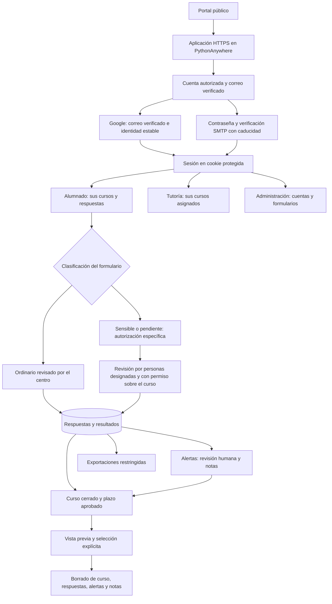

# Cuestionarios: privacidad y actualización

Versión modificada localmente el 6 de octubre de 2026. Esta guía actualiza las instrucciones anteriores. Los cambios no se han desplegado ni constituyen una certificación RGPD.

## Funcionamiento y límites de acceso



Google participa solo cuando se elige ese acceso. El proveedor SMTP recibe el correo de verificación. El portal no sustituye los controles de cada aplicación. No se han identificado llamadas a proveedores de IA en el código revisado: las puntuaciones y alertas proceden de reglas. Las alertas no son diagnósticos ni un servicio de emergencia; el centro debe establecer quién las atiende, en qué plazo y cómo se pide ayuda por otro canal.

## Qué cambia

- El registro público ya no concede administración ni verificación por escribir un correo incluido en `ADMIN_EMAILS`. Primero exige comprobar el correo; sin SMTP funcional no crea la cuenta. Las altas se limitan a correos exactos autorizados.
- Los enlaces de verificación caducan a las 24 horas, solo sirven una vez y se guardan como hashes. La migración invalida los enlaces antiguos sin caducidad. El enlace llega al backend correcto y, tras verificar, vuelve a la pantalla de acceso.
- Google debe confirmar `email_verified` y aportar una identidad `sub`; se rechazan identidades contradictorias y cuentas desactivadas. Si una cuenta no verificada entra con Google, se elimina la contraseña establecida antes de demostrar el control del correo.
- Las sesiones caducan a las dos horas. Se usan cookies HttpOnly, Secure en producción y SameSite=Lax, con protección CSRF y control de origen para las escrituras. No se envían sesiones por URL ni se guardan sesiones o perfiles en localStorage. El cierre invalida todas las sesiones de la cuenta; los cambios administrativos y la desactivación invalidan sesiones previas.
- Login y registro tienen límites compartidos por los procesos de la aplicación: 10 solicitudes por correo y 200 por dirección de origen, por endpoint, en ventanas fijas de 15 minutos. Se guardan identificadores HMAC, sin correo o IP en claro. Se limpian en la siguiente petición de autenticación o mediante `flask --app backend.app purge-auth-attempts`; programar la limpieza para periodos sin uso. Comprobar la dirección de origen que entrega el alojamiento, sin confiar en cabeceras de proxy suministradas por el cliente.
- Las claves de ejemplo o insuficientes impiden el arranque. Se elimina la creación de la aplicación y de la base como efecto de importar módulos; las actualizaciones requieren migraciones explícitas. La autocreación de tablas queda reservada a las pruebas.
- Las respuestas de cursos cerrados o formularios archivados se rechazan. Se validan las preguntas, filas, opciones y duplicados antes de guardar. Las celdas de texto exportadas a Excel se escriben como texto; se neutralizan fórmulas en los campos de texto exportados a CSV.
- `/privacidad` ofrece información específica y señala los campos institucionales pendientes. Los datos de API y los informes llevan cabeceras que impiden su almacenamiento en caché; las páginas no envían el referente.

## Separación de cuestionarios ordinarios y sensibles

`SENSITIVE_DATA_ENABLED=false` es el valor predeterminado. Todos los formularios existentes y nuevos parten de `requires_sensitive_approval=true`: quedan pendientes de revisión, sin destruir respuestas existentes.

En administración se puede guardar la clasificación de un formulario como ordinario **después de revisar todas sus versiones, preguntas, campos abiertos y finalidad**. No basta con cambiar el título. El código impide clasificar como ordinario un formulario que contiene preguntas críticas. Crear versiones o editar su estructura vuelve a marcarlo como pendiente; las copias también empiezan pendientes. La detección por código no identifica toda posible información de salud: sigue siendo necesaria la revisión del centro.

Los formularios pendientes o sensibles no se ofrecen ni aceptan respuestas mientras el interruptor esté desactivado. Tampoco se muestran sus resultados, alertas o exportaciones. Los cuestionarios históricos se tratan conservadoramente como sensibles. Si un informe de curso mezcla datos ordinarios y sensibles bloqueados, se rechaza el informe completo para evitar una exportación incompleta que pase inadvertida.

Para un tratamiento sensible autorizado se requiere `SENSITIVE_DATA_ENABLED=true`. Además, las personas tutoras y administradoras que consulten esos datos deben estar expresamente incluidas en `SENSITIVE_REVIEWER_EMAILS`. La designación **no elimina** la restricción al curso asignado de la tutoría. El alumnado solo utiliza sus accesos propios. La administración puede seguir gestionando plantillas, cuentas y supresiones sin recibir por ello acceso automático a informes sensibles.

Activar una variable no constituye autorización jurídica. Antes de hacerlo, el centro debe documentar la finalidad, condiciones aplicables a los datos de salud, necesidad y proporcionalidad, tratamiento de menores, análisis de riesgos y evaluación de impacto cuando proceda, personas designadas y protocolo de intervención. Estos puntos quedan pendientes de revisión institucional.

## Variables que hay que completar

Consultar `.env.example`. La aplicación carga el `.env` de la raíz y respeta las variables ya definidas en el entorno. No publicar ese archivo ni copiar el ejemplo sobre la configuración de producción.

| Variable | Decisión o configuración necesaria |
|---|---|
| `SECRET_KEY`, `JWT_SECRET_KEY` | Dos claves aleatorias distintas de al menos 32 caracteres. |
| `DATABASE_URL` | Ruta de la base existente, preferiblemente absoluta. Una ruta nueva abriría otra base. |
| `FRONTEND_URL`, `BACKEND_URL` | Misma dirección HTTPS de la aplicación, sin barra final. |
| `COOKIE_SECURE` | `true` en producción; `false` únicamente en desarrollo local HTTP. |
| `ADMIN_EMAILS` | Correos exactos designados para administración tras verificar su identidad. Quitar también de esta lista a quien deje de ser administrador. |
| `REGISTRATION_EMAILS` | Correos exactos autorizados para altas; no equivale a desactivar cuentas existentes. |
| `GOOGLE_CLIENT_ID`, `GOOGLE_CLIENT_SECRET` | Credenciales aprobadas; callback `/api/auth/google/callback`. |
| `MAIL_*` | SMTP y remitente aprobados, con TLS. El diagnóstico del correo queda desactivado para no imprimir mensajes ni enlaces. |
| `SENSITIVE_DATA_ENABLED`, `SENSITIVE_REVIEWER_EMAILS` | Activación institucional del tratamiento y personas designadas para revisar datos sensibles. |
| `RETENTION_DAYS` | Entero positivo aprobado. Vacío mantiene deshabilitada la limpieza por plazo. |
| `PRIVACY_CONTROLLER`, `PRIVACY_CONTACT` | Responsable, canal de derechos y contacto del DPD cuando corresponda. |
| `PRIVACY_LEGAL_BASIS` | Bases y condiciones aplicables a cada uso, incluidas las específicas para datos de salud. |
| `PRIVACY_RETENTION` | Plazos o criterios para respuestas, notas, cuentas, exportaciones, registros y copias. |
| `PRIVACY_PROVIDERS` | Proveedores reales, ubicación, encargados y transferencias según los contratos. |

Frontend y API deben servirse bajo el mismo origen. En desarrollo, el proxy de Angular incluye `/api` y `/privacidad`. Un despliegue del frontend en GitHub Pages con la API en otro dominio necesita un diseño y comprobación adicionales.

## Actualizar PythonAnywhere

1. Mantener la pausa con datos reales hasta la validación del centro. Revisar las cuentas privilegiadas existentes: el fallo anterior permitía altas sin prueba de identidad. La migración conserva las cuentas; no puede determinar retrospectivamente quién las creó. Desactivar las no reconocidas, revisar registros restringidos y renovar claves antes de reabrir.
2. Programar una ventana sin escrituras y respaldar código, configuración y base en un destino restringido. Ensayar la actualización sobre una copia. No usar datos del alumnado en las pruebas.
3. Instalar `requirements.txt` en el entorno virtual. Copiar el frontend compilado a `frontend/dist/autopercepcion/browser`. Para compilar: desde `frontend`, ejecutar `npm ci` y `npm run build`.
4. Completar las variables. Forzar HTTPS en el alojamiento, comprobar el callback de Google y desactivar debug. WSGI continúa utilizando `from backend import create_app; application = create_app()`.
5. Desde la raíz del proyecto, con el entorno virtual activo, ejecutar `flask --app backend.app db current` y después `flask --app backend.app db upgrade`. La migración nueva parte de `37d102ca7e27`, añade campos de sesión, identidad, verificación y clasificación, crea contadores de autenticación y fecha los cursos existentes desde la actualización para no borrarlos inmediatamente.
6. Si la instalación no tiene historial Alembic porque usaba autocreación, comparar primero el esquema con las migraciones. Solo si coincide con `37d102ca7e27`, registrar esa revisión mediante `db stamp 37d102ca7e27` y ejecutar `db upgrade`. No marcar un esquema desconocido como actualizado.
7. Los enlaces de verificación anteriores dejan de funcionar. Las cuentas pendientes requieren una nueva comprobación de identidad por administración; no marcarlas como verificadas sin esa comprobación. Las sesiones anteriores dejan de aceptarse. Revisar administradores, tutores, designaciones para salud y clasificación de formularios antes de activar accesos.
8. Recargar y probar con cuentas ficticias: registro/verificación SMTP, Google, cierre, revocación, aislamiento entre cursos, bloqueo sensible, alertas y exportaciones. Google y SMTP se simulan en los tests locales; queda comprobarlos en la configuración real.

Para instalaciones nuevas: `db upgrade` seguido de `seed-data`. Para volver atrás, restaurar conjuntamente el código, la configuración y la copia de la base durante la ventana de mantenimiento; evitar perder escrituras posteriores.

## Conservación y supresión

El plazo se cuenta desde la última fecha disponible entre actualización/cierre del curso, matrículas, asignaciones, respuestas históricas o versionadas y revisión de alertas. Se excluyen cursos activos y cualquier curso con alertas pendientes de revisión.

```sh
flask --app backend.app purge-expired
flask --app backend.app purge-expired --course-id 12
# Solo tras revisar el candidato, sin escrituras concurrentes:
flask --app backend.app purge-expired --course-id 12 --execute
```

El 12 es un ejemplo; utilizar los identificadores revisados. Se puede repetir `--course-id`. Cualquier selección no elegible rechaza toda la operación. No hay un plazo inventado ni una tarea automática de borrado. Las alertas pendientes se excluyen de esta limpieza, pero no deben conservarse indefinidamente por olvido: el centro debe resolver su revisión y conservación.

Se borran curso, matrículas, asignaciones, intentos, respuestas, alertas y notas de revisión. Se conservan cuentas y plantillas compartidas. Las opciones administrativas de borrado definitivo ya existentes permiten resolver supresiones individualizadas tras desactivar o archivar; no están condicionadas por el plazo automático y requieren revisar la procedencia del borrado, incluidas las alertas.

El borrado de filas no garantiza sobrescritura física de SQLite ni elimina descargas, copias o registros externos. El centro debe gestionar esas ubicaciones y comprobar posibles obligaciones o reclamaciones antes de borrar. Revisar también los registros de acceso del alojamiento, que pueden conservar rutas con enlaces de verificación; restringirlos y aplicar ocultación o rotación según lo permita el proveedor.

## Verificación y aceptación

Pruebas locales: instalar `requirements-dev.txt` y ejecutar `python -m pytest`. Utilizan datos sintéticos y una base temporal para ensayar la migración. Compilación: `npm run build` en `frontend`.

La aceptación aún requiere confirmar versión desplegada, titularidad y control institucional del alojamiento, contratación y garantías de proveedores, información a personas afectadas, autorizaciones, plazos, respuesta a derechos, incidentes y restauración de copias. Tener un correo Gmail en PythonAnywhere no demuestra por sí solo quién ostenta la titularidad contractual. No se ha realizado una auditoría completa de dependencias ni del alojamiento.
